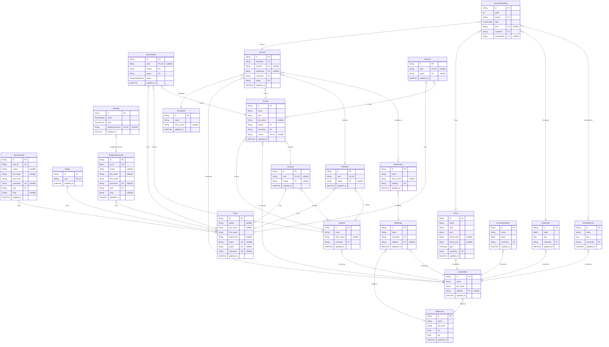

# Thodle ERD

> Generated by [`prisma-markdown`](https://github.com/samchon/prisma-markdown)

- [default](#default)

## default

### `Addresses`

Properties as follows:

- `id`:
- `name`:
- `full_name`:
- `lon`:
- `lng`:
- `updated_at`:

### `MaxAccounts`

Properties as follows:

- `id`:
- `max_id`:
- `avatar`:
- `last_name`:
- `first_name`:
- `username`:
- `user`:
- `lang`:
- `updated_at`:

### `Metas`

Properties as follows:

- `id`:
- `user`:
- `updated_at`:

### `Settings`

Properties as follows:

- `id`:
- `mode`:
- `color`:
- `telegramAccount`:
- `updated_at`:

### `TelegramAccounts`

Properties as follows:

- `id`:
- `tg_id`:
- `avatar`:
- `last_name`:
- `first_name`:
- `username`:
- `user`:
- `lang`:
- `updated_at`:

### `Users`

Properties as follows:

- `id`:
- `avatar`:
- `last_name`:
- `first_name`:
- `patronymic`:
- `email`:
- `phone`:
- `username`:
- `updated_at`:

### `Times`

Properties as follows:

- `id`:
- `name`:
- `start`:
- `end`:
- `break_start`:
- `break_end`:
- `type`:
- `university`:
- `updated_at`:

### `Auditoriums`

Properties as follows:

- `id`:
- `name`:
- `short_name`:
- `building`:
- `updated_at`:

### `Buildings`

Properties as follows:

- `id`:
- `name`:
- `university`:
- `address`:
- `updated_at`:

### `Clusters`

Properties as follows:

- `id`:
- `name`:
- `short_name`:
- `university`:
- `updated_at`:

### `Curators`

Properties as follows:

- `id`:
- `user`:
- `cluster`:
- `updated_at`:

### `Disciplines`

Properties as follows:

- `id`:
- `name`:
- `short_name`:
- `updated_at`:

### `Groups`

Properties as follows:

- `id`:
- `name`:
- `year`:
- `full_name`:
- `cluster`:
- `university`:
- `curator`:
- `updated_at`:

### `GroupHeads`

Properties as follows:

- `id`:
- `user`:
- `cluster`:
- `group`:
- `status`:
- `updated_at`:

### `Lessons`

Properties as follows:

- `id`:
- `discipline`:
- `teacher`:
- `auditorium`:
- `university`:
- `group`:
- `updated_at`:

### `LessonSchedules`

Properties as follows:

- `id`:
- `order`:
- `lesson`:
- `type`:
- `time`:
- `schedule`:
- `scheduleFix`:

### `Schedules`

Properties as follows:

- `id`:
- `week`:
- `day`:
- `university`:
- `updated_at`:

### `ScheduleFixes`

Properties as follows:

- `id`:
- `week`:
- `day`:
- `university`:
- `updated_at`:

### `Students`

Properties as follows:

- `id`:
- `user`:
- `group`:
- `updated_at`:

### `Teachers`

Properties as follows:

- `id`:
- `user`:
- `cluster`:
- `updated_at`:

### `Universities`

Properties as follows:

- `id`:
- `name`:
- `full_name`:
- `address`:
- `updated_at`:

### `UniversityWeeks`

Properties as follows:

- `id`:
- `name`:
- `week`:
- `university`:
- `updated_at`:
